# FortiSOAR Workshop

## Technologies Utilized

* FortiSOAR
* FortiAnalyzer
* FortiGate
* Azure
* FlightSim by Alpha SOC

Fortinet Security Orchestration Platform™ (FortiSOAR™) is a scalable, awareness-driven, and encrypted security management intelligence platform. FortiSOAR is a centralized hub for your security operations and dramatically improves the effectiveness and efficiency of your security operations teams, by providing automation and customizable mechanisms for prevention, detection, and response to cybersecurity threats.

This workshop uses FortiSOAR, FortiAnalyzer, and FortiGate deployed in Azure. You will will connect these components via APIs (Connectors) and spoof malicious data creating alerts in FortiSOAR. Once we have all that done, we will proceed to tackle the Security event in FortiSOAR like a real SOC team would. Today you will be putting on your ADMIN hat, Security Architect Hat, and Analyst Hat.

## Workshop Main Objectives

* FortiSOAR
  * Deployment
  * Connector Configuration
  * Asset Management
  * Data Ingestion
  * Playbook deploy and Run
  * Incident Response Workshop

* FortiAnalyzer
  * Create API User
  * Connect to FortiSOAR

* FortiGate
  * Connect to FortiAnalyzer

***

## Deploy / Setup the environment (40min)

### Task 1 FortiSOAR Configuration and Licensing

> All of the CLI steps in this task can be completed via the Azure Cloudshell environment.
> Multiple browser tabs can be opened to the Azure environment and Cloudshell.

#### Login to Azure / Display Environment Information

1. Login to [Azure](https://portal.azure.com) with provided credentials
1. Open Cloudshell
1. Change to the FortiSOAR Lab directory
    * `cd ./fortisoar-lab/fortisoar-fortianalyzer-fortigate/`
1. Run
    * `terraform output`  - to display lab IP addresses and credentials

  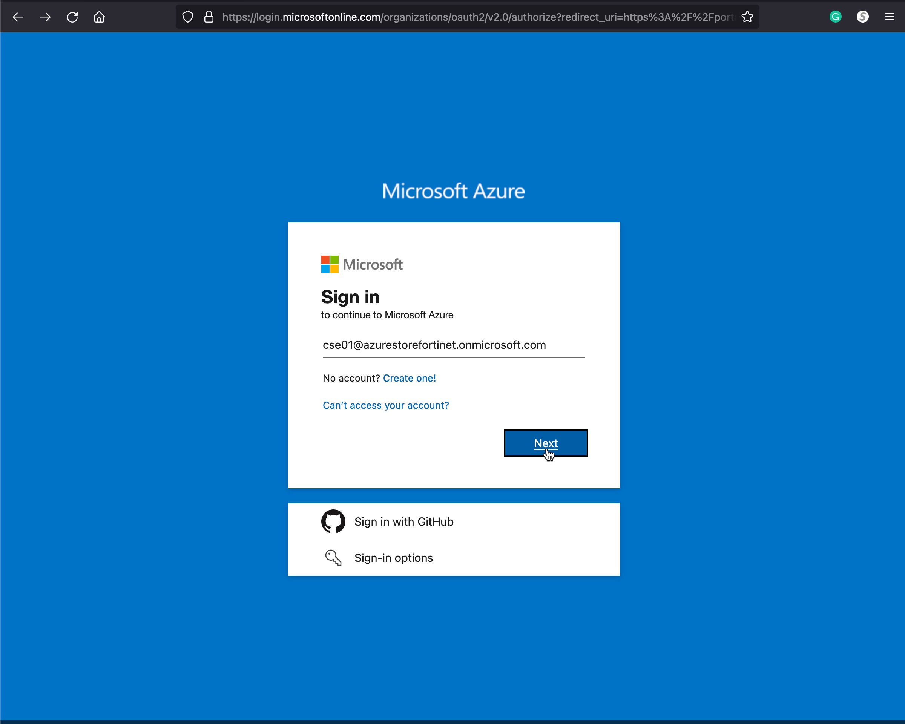
  
  

#### Deploy FortiSOAR

1. Run
    * `ssh csadmin@<ip-address-of-fortisoar-vm>` insert your FortiSOAR IP or run the command below to have the IP pulled from the terraform output

    ```bash
    ssh csadmin@$(terraform output | grep FortiSOAR | awk -F/ '{print $3}' | sed -e 's/\"$//')

    ```

    * Current Password is `changeme`
    * Supply Current Password `changeme` again
    * Supply New Password and confirm it

1. Restart ssh session `ssh csadmin@<ip-address-of-fortisoar-vm>` with new password
1. An automated FortiSOAR configuration script will run.

    1. Select "Continue"
    1. Select "Accept"
    1. Select "OK"
    1. Select "OK"
    1. Select "OK"
    1. Select "OK"
    1. Select "Proceed"

    * **IMPORTANT DO NOT CLICK OK BEFORE COPYING THE DEVICE UUID**

    1. Use the Device UUID to register your license at [support.fortinet.com](https://support.fortinet.com)
    1. Download license file

    1. Browse to FortiSOAR web interface
    1. Use your FortiCloud Account to activate the trial license.
        1. User FortiCloud Account to Activate Trial License
        1. Accept License Agreement
    1. Login
        * Username: `csadmin`
        * Password: `changeme`
    1. Change Password

  
  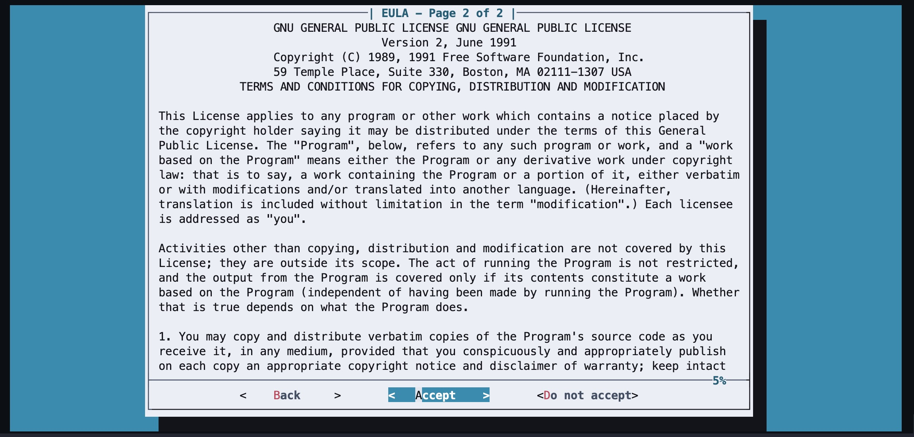
  
  
  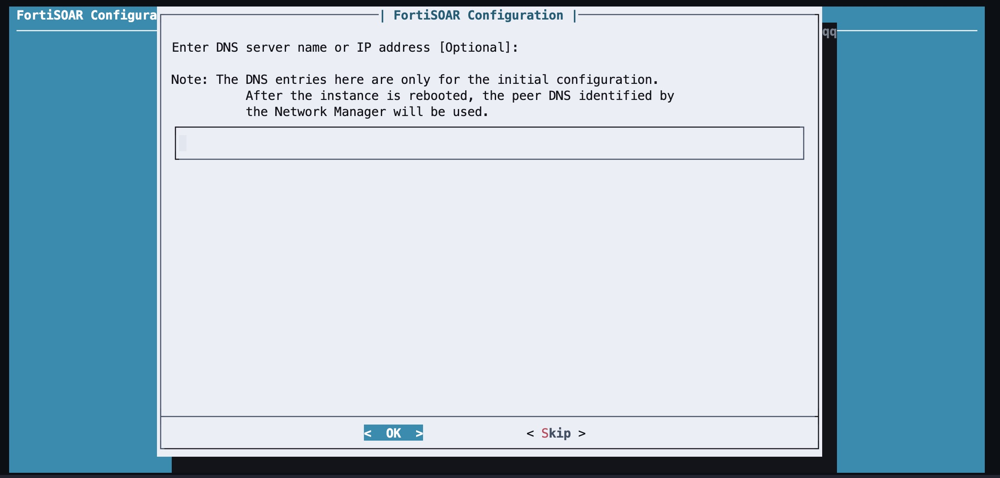
  
  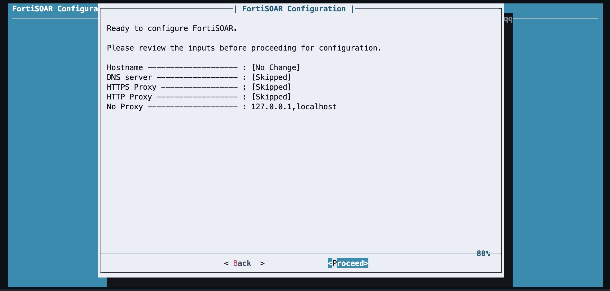
  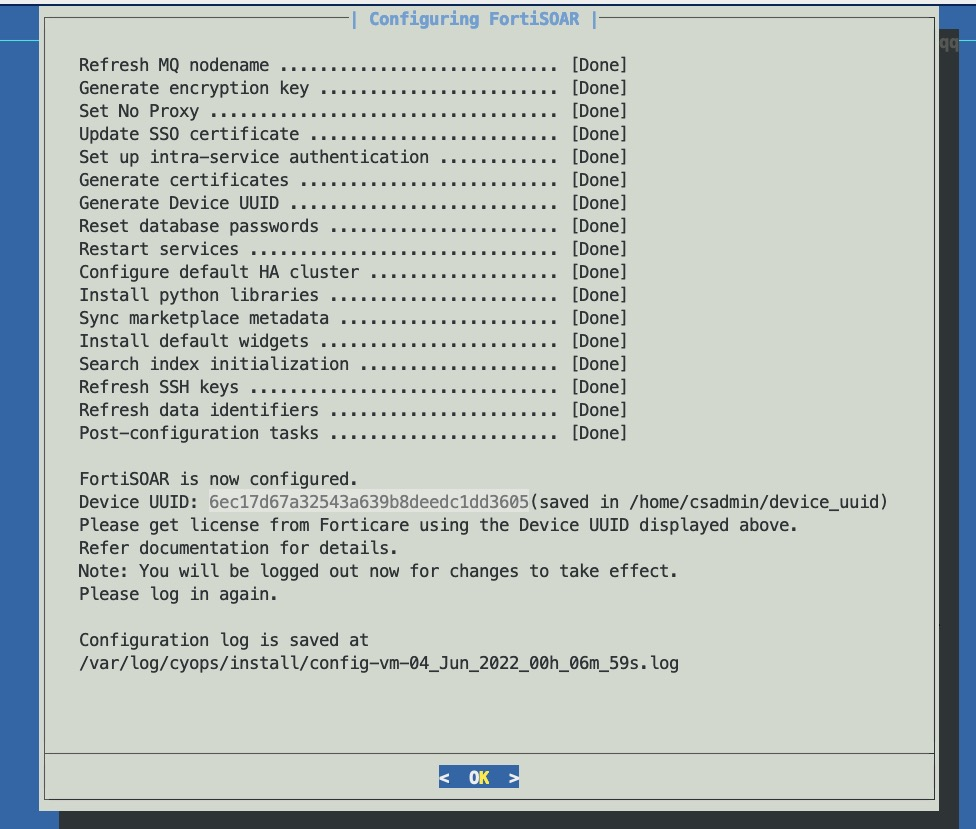

### Task 2 Setup FortiAnalyzer / Create API User

#### Activate FortiAnalyzer Trial License / Change Password

1. Open Browser to FortiAnalyzer web interface
    * Upload provided license file
1. Login to FortiAnalyzer web interface
    * Credentials are displayed using `terraform output`
    * Complete FortiAnalyzer setup, accept defaults
1. Change FortiAnalyzer Password

#### Create API User for Connection to FortiSOAR

1. Click "System Settings"
1. Click "Admin"
1. Click "Administrators"
1. Click "+ Create New"
    * User Name: **apiuser**
    * Password: **SecurityFabric**
    * Admin Profile: **Super_user**
    * JSON API Access: **Read-Write**
    * Click "OK"

  
  
  

### Task 3 Connect FortiGate to FortiAnalyzer

1. Login to FortiGate web interface
    * Credentials are displayed using `terraform output`

1. Edit FortiAnalyzer Fabric Connector
1. Enable FortiAnalyzer Fabric Connector
1. Enter FortiAnalyzer - IP address can be found using `terraform output`
1. Click "Test Connectivity"
    * "Unauthorized" should appear beneath the IP address
1. Click "OK"
1. Re-Edit FortiAnalyzer Fabric Connector
1. Click "Authorize" in the ***FortiAnalyzer Status*** right-hand pane
    * Login to FortiAnalyzer
    * Click "Approve"
    * Click "OK"
1. Click "Test Connectivity"
    * "Connected" should appear beneath the IP address

  
  
  
  

### Task 4 Setup Malicious Network Traffic Utility and Generate Traffic

1. Open CLI Session on FortiGate
1. SSH to vm-harry-pc
    * `execute ssh azureuser@10.135.6.5`
1. Download and Install Malicious Traffic Network Utility - FlightSim by Alpha SOC
1. Run `flightsim run` to generate malicious traffic

    ```bash
    wget https://github.com/alphasoc/flightsim/releases/download/v2.2.2/flightsim_2.2.2_linux_64-bit.deb
    sudo dpkg -i flightsim_2.2.2_linux_64-bit.deb
    flightsim run

    ```

  
  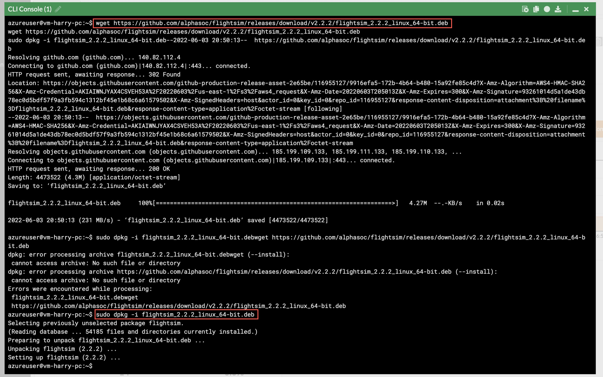

## FortiSOAR Connectors and Playbooks (40min)

### Task 1 Configure FortiSOAR Connectors

#### FortiAnalyzer Connector

1. Login to FortiSOAR web interface
1. Click on Automation -> Connectors
1. Click the "Discover" Tab
1. Enter "FortiAnalyzer" in the search bar
1. Click the "FortiAnalyzer" tile
1. Click "Install"
1. Click "Confirm" in the Confirm Dialog
1. Create a Configuration
    * Configuration Name: `Workshop config`
    * Server URL: `https://<your-faz-ip-address>/` <- make sure you have the trailing slash
    * Username: `apiuser`
    * Password: `SecurityFabric`
    * ADOM Name: `root`
    * Port: `443`
    * Uncheck Verify SSL
    * Click "Save" <- When a successful connection is made the connector will display a "HEALTH CHECK: AVAILABLE" indicator

  
  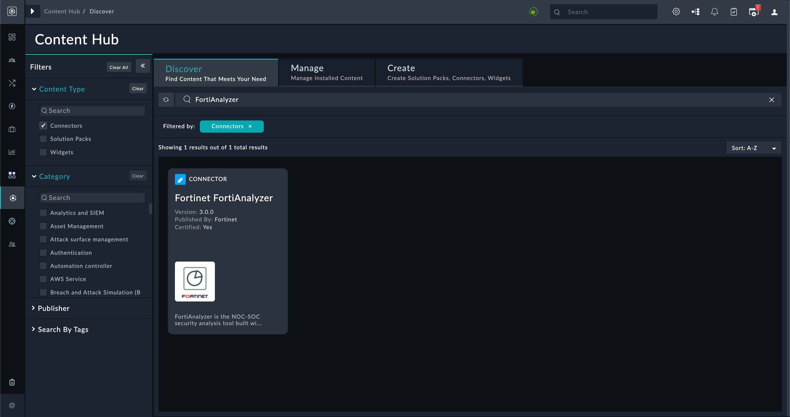
  
  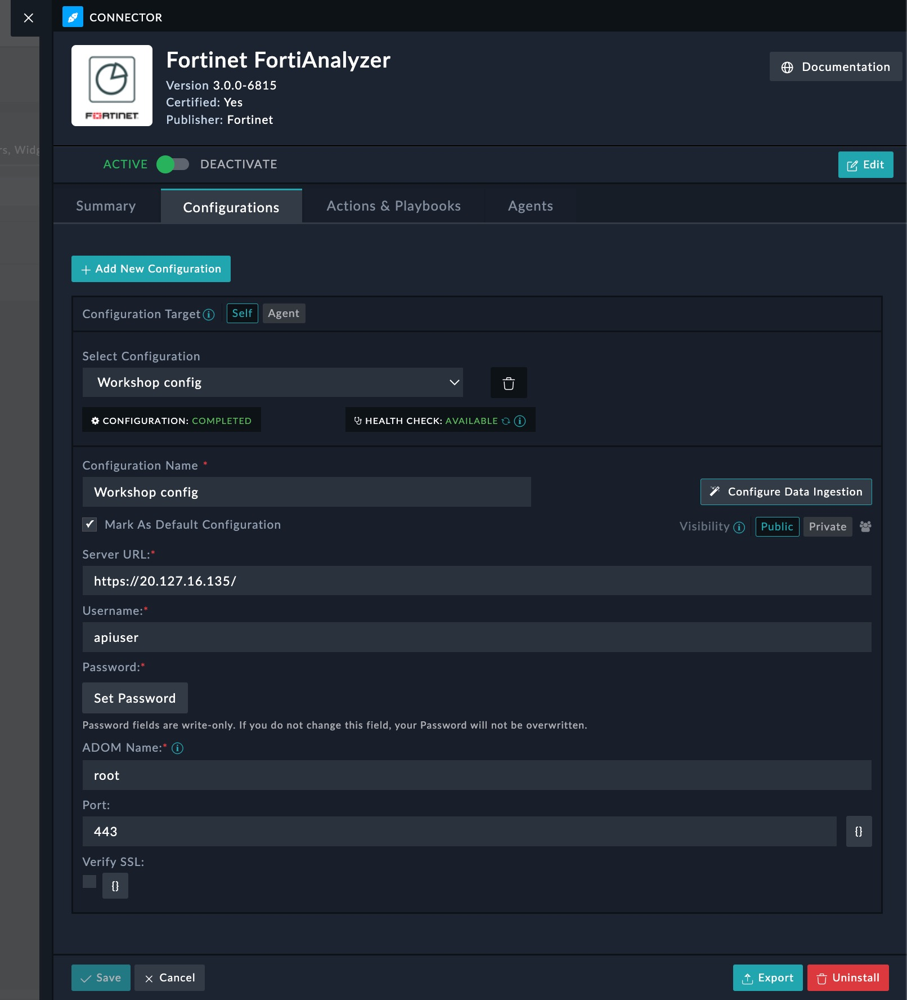

#### Azure Compute Connector

1. Click the "Discover" Tab
1. Enter "Azure Compute" in the search bar
1. Click the "Azure Compute" tile
1. Click "Install"
1. Click "Confirm" in the Confirm Dialog
1. Create a Configuration
    * Configuration Name: `Workshop config`
    * Directory (Tenant) ID: *Value to be provided*
    * Application (Client) ID: *Value to be provided*
    * Application (Client) Secret:*Value to be provided*
    * Click "Save" <- When a successful connection is made the connector will display a "HEALTH CHECK: AVAILABLE" indicator

  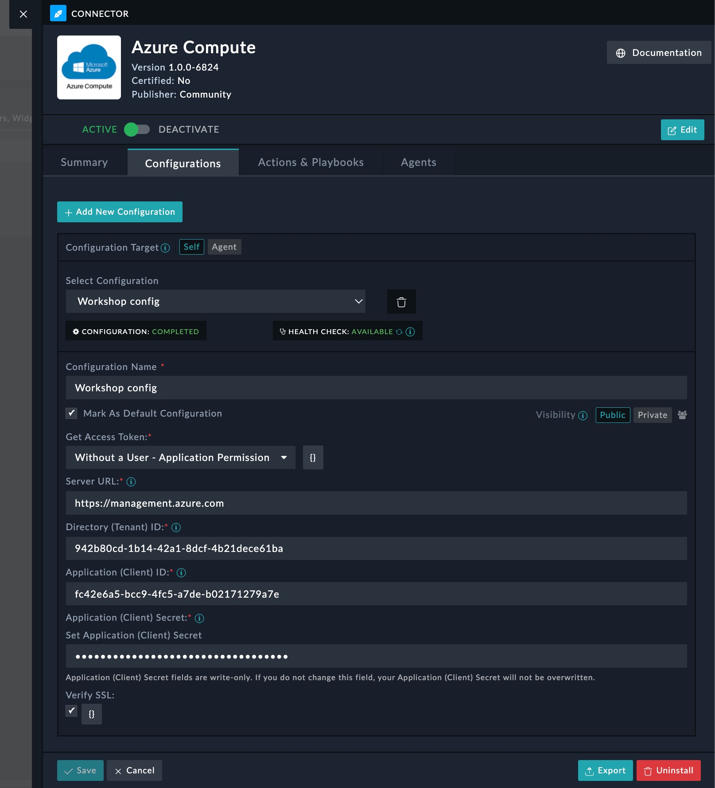

### Task 2 Create and Execute FortiSOAR Playbooks

#### Asset Records Playbook Create

1. Click on Automation -> Playbooks
1. Click "+ Add Playbook"
    1. Name: `Asset Records`
    1. Click "Create"
    1. Choose a Trigger - "Manual"
    1. Select Execution Behavior - "Does not require a record input to run"
    1. Select Module - "Assets"
    1. Click "Save"
    1. Grab the Blue Orb next to the **Start** step and drag out a new step
    1. Select "Set Variable"
    1. Step Name: "Asset Records"
    1. Variables: "+ Add New"
        1. Variable: `assets`
        1. Value: copy and paste the JSON text below

            ```bash
            {
              "Results": [
                      {"ip":"10.135.6.4","name":"vm-bobby-pc"},
                      {"ip":"10.135.6.5","name":"vm-harry-pc"},
                      {"ip":"10.135.6.6","name":"vm-sally-pc"},
                  ]
            }
            ```

            These are the contents of the file `vm-assets.json` from the Cloudshell terraform directory. This file was created as part of the Terraform apply step.

        1. Click "Save"

    1. Grab the Blue Orb next to the **Asset Records** step and drag out a new step
    1. Select "Create Record"
    1. Step Name: "Create Assets"
    1. Select Module - "Assets"
    1. MAC Address: NONE
    1. Click "+ Loop" at bottom of screen
    1. Click in the "Array of objects..." field
        1. Enter `{{vars.assets.Results}}`  
    1. Scroll up to Fields
        1. "IP Address" field enter `{{vars.item.ip}}`
        1. "Hostname" field enter `{{vars.item.name}}`
    1. Click "Save"
    1. Click "Save Playbook"

  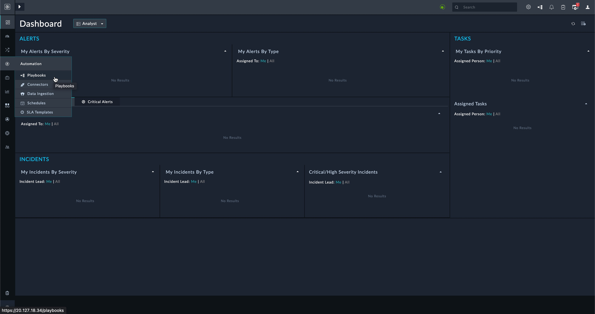
  
  
  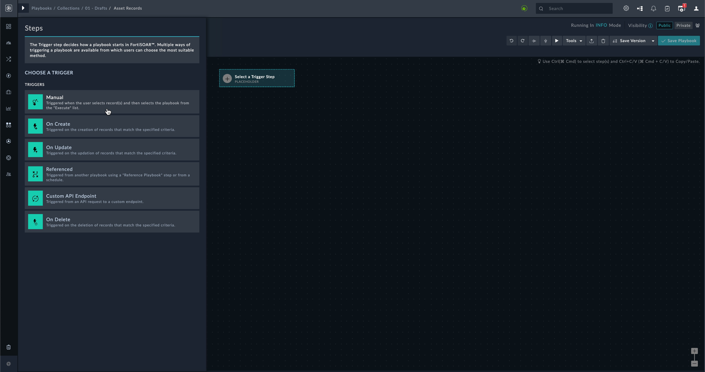
  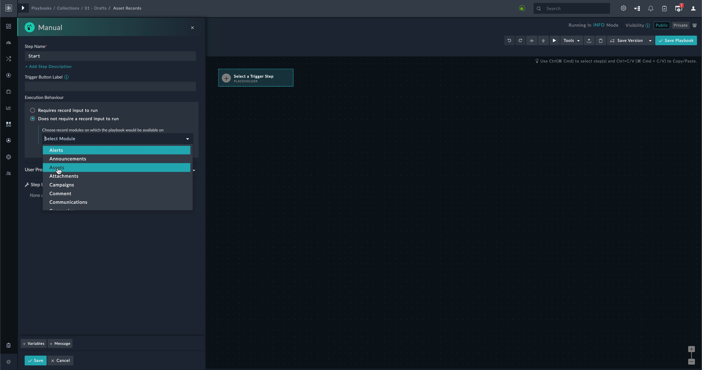
  
  
  
  

#### Asset Records Playbook Run

1. Click on Resources -> Assets
1. Click "Execute"
1. Click "Asset Records" <- the screen will refresh with the asset records

  
  
  

#### Block C&C Playbook Create

1. Click on Automation -> Playbooks
1. Click "+ Add Playbook"
    1. Name: `Block C&C`
    1. Click "Create"
    1. Choose a Trigger - "On Create"
    1. Select Module - "Alerts"
    1. Click "+ ADD CONDITION"
        1. Select a field - `Name`
        1. Select Operator - `Contains`
        1. Name - `Traffic to C&C`
    1. Click "Save"
    1. Grab the Blue Orb next to the **Start** step and drag out a new step
    1. Select "Find Records"
    1. Step Name "Find Assets"
    1. Select Module - "Assets"
    1. Click "+ ADD CONDITION"
        1. Select a field - `IP Address`
        1. Select Operator - `Equals`
        1. IP Address Field
            1. Click in field
            1. Find and Click "Source IP" in the Dynamic Values Input. The result in the field should be, `{{vars.input.records[0].sourceIp}}`
    1. Click "Save"
    1. Grab the Blue Orb next to the **Find Asset** step and drag out a new step
    1. Select "Connector"
    1. Search for "Azure Compute"
    1. Click "Azure Compute"
    1. Step Name: "Stop Instance"
    1. Select Action - "Stop an Instance"
    1. Inputs
        1. Subscription ID - Pick the only available option
        1. Resource Group Name - Pick your Resource Group Name
        1. Virtual Machine Name - Click the curly braces {}
            1. Click in the empty field
            1. In Dynamic Values Open Step results
            1. Select Hostname - the result in the field should be. `{{vars.steps.Find_Assets[0].hostname}}`
    1. Click "Save"
    1. Grab the Blue Orb next to the **Stop Instance** step and drag out a new step
    1. Click "Update Record"
    1. Step Name "Update Severity and Add Notes"
    1. Model "Alerts"
    1. Record IRI - Click in field and select Dynamic Values **Input** "@id"
    1. Type asset in search box under Fields
    1. Add asset ID to Assets Field - Click in field and select Dynamic Values **Step Results** Find Asset "@id"
    1. Click "+ Message" Button at bottom of screen
    1. Add Message
        1. `Hostname: {{vars.steps.Find_Asset[0].hostname}} was shutdown by playbook due to malicious activity.`

        1. Highlight the word malicious in red
    1. Click "Save"
    1. Click "Save Playbook"

    
    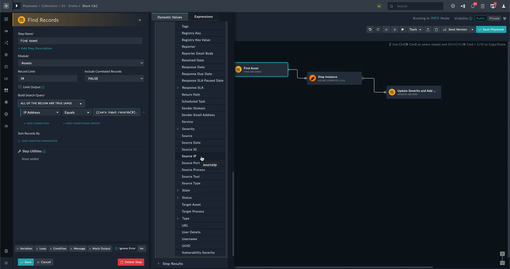
    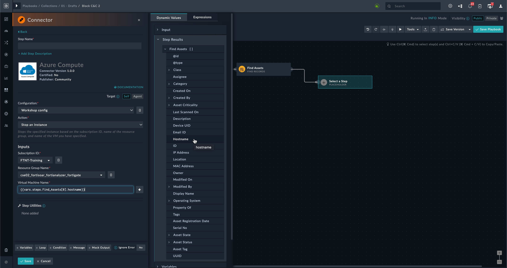
    
