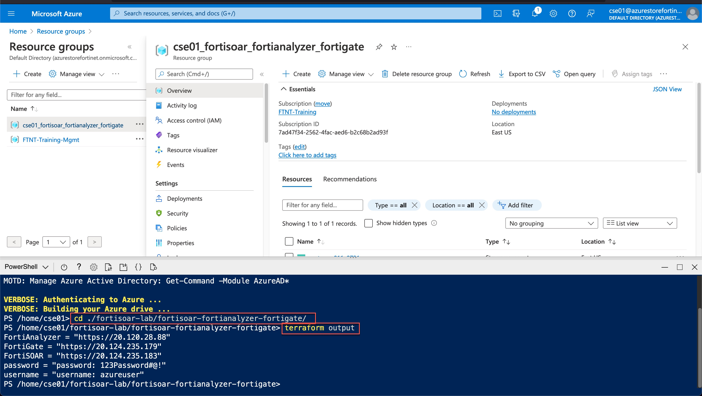
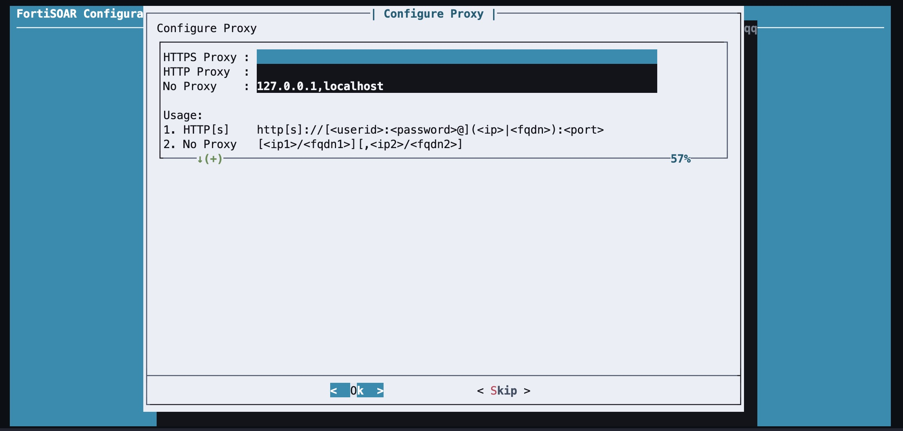
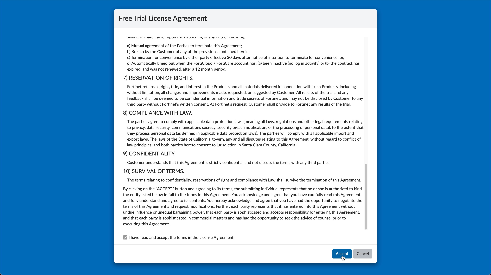
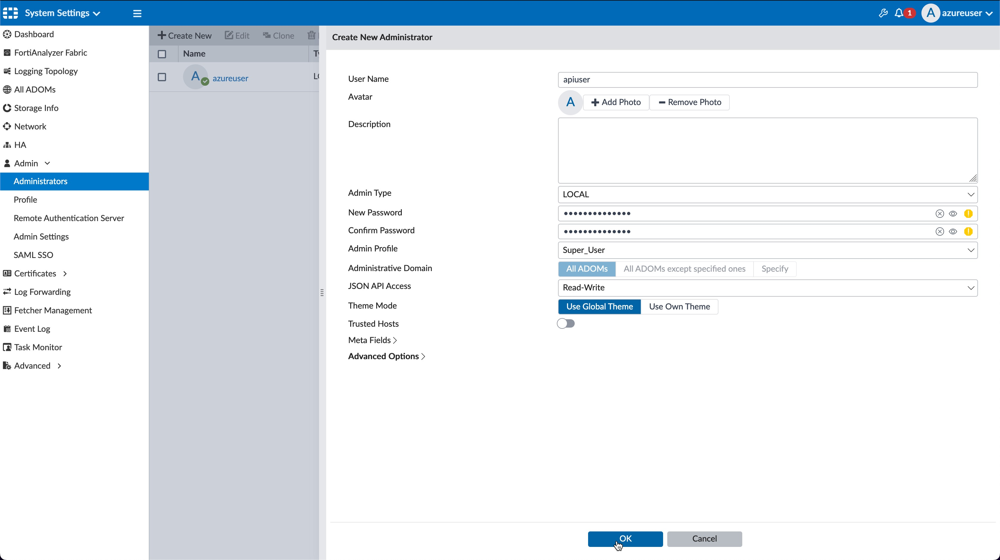

# FortiSOAR Workshop

## Workshop Main Objectives

* FortiSOAR
  * Deployment
  * Connector Configuration
  * Data Ingestion
  * Playbook deploy and Run
  * Incident Response Workshop

* FortiAnalyzer
  * Create API User
  * Connect to FortiSOAR

* FortiGate
  * Connect to FortiAnalyzer
  * Connect tp FortiSOAR

***

## Deploy / Setup the environment (40min)

### Task 1 FortiSOAR Configuration and Licensing

> All of the CLI steps in this task can be completed via the Azure Cloudshell environment.
> Multiple browser tabs can be opened to the Azure environment and Cloudshell.

#### Login to Azure / Display Environment Information

1. Login to [Azure](https://portal.azure.com) with provided credentials
1. Open Cloudshell
1. Change to the FortiSOAR Lab directory
    * `cd ./fortisoar-lab/fortisoar-fortianalyzer-fortigate/`
1. Run
    * `terraform output`  - to display lab IP addresses and credentials

  
  
  

#### Deploy FortiSOAR

1. Run
    * `ssh csadmin@<ip-address-of-fortisoar-vm>`
    * Current Password is `changeme`
    * Supply Current Password `changeme` again
    * Supply New Password and confirm it

1. Restart ssh session `ssh csadmin@<ip-address-of-fortisoar-vm>` with new password
1. An automated FortiSOAR configuration scrip with run.

    1. Select "Continue"
    1. Select "Accept"
    1. Select "OK"
    1. Select "OK"
    1. Select "OK"
    1. Select "OK"
    1. Select "Proceed"
    1. Select "OK" When the process is completed, the ssh session will terminate.

1. Browse to FortiSOAR web interface
1. Use your FortiCloud Account to activate the trial license.
    1. User FortiCloud Account to Activate Trial License
    1. Accept License Agreement
1. Login
    * Username: `csadmin`
    * Password: `changeme`
1. Change Password

  
  
  
  
  
  
  

### Task 2 Setup FortiAnalyzer / Create API User

#### Activate FortiAnalyzer Trial License / Change Password

1. Open Browser to FortiAnalyzer web interface
    * Activate Trial License with FortiCloud Account
    * Accept Trial License Agreement - FortiAnalyzer will restart
1. Login to FortiAnalyzer web interface
    * Credentials are displayed using `terraform output`
    * Complete FortiAnalyzer setup, accept defaults
1. Change FortiAnalyzer Password

#### Create API User for Connection to FortiSOAR

1. Click "System Settings"
1. Click "Admin"
1. Click "Administrators"
1. Click "+ Create New"
    * User Name: **apiuser**
    * Password: **SecurityFabric**
    * Admin Profile: **Super_user**
    * JSON API Access: **Read-Write**
    * Click "OK"

  
  
  

### Task 3 Connect FortiGate to FortiAnalyzer

1. Login to FortiGate web interface
    * Credentials are displayed using `terraform output`

1. Edit FortiAnalyzer Fabric Connector
1. Enable FortiAnalyzer Fabric Connector
1. Enter FortiAnalyzer - IP address can be found using `terraform output`
1. Click "Test Connectivity"
    * "Unauthorized" should appear beneath the IP address
1. Turn off "Verify FortiAnalyzer certificate"
1. Click "OK"
1. Click "Authorize" in the ***FortiAnalyzer Status*** right-hand pane
    * Login to FortiAnalyzer
    * Click "Approve"
    * Click "OK"
1. Click "Test Connectivity"
    * "Connected" should appear beneath the IP address

  
  
  
  
